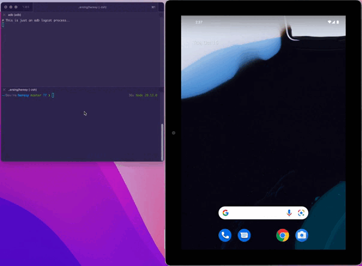
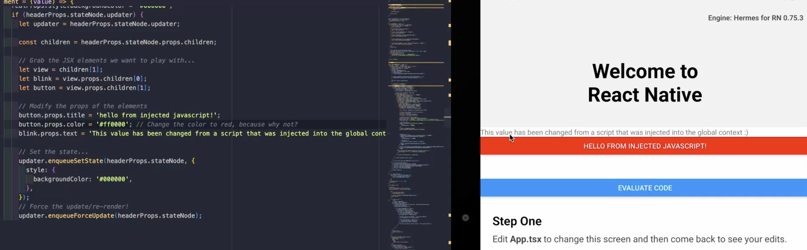

# Heresy  

Heresy is a simple experimental utility that allows you to inspect and instrument React Native applications at runtime.  


It utilizes [frida](https://frida.re/) to inject javascript into the Hermes Engine global context, and a small suite of helper scripts to make this easier.  

**Blog Post + Tutorial**: [https://pilfer.github.io/mobile-reverse-engineering/react-native/heresy-inspect-and-instrument-react-native-apps/](https://pilfer.github.io/mobile-reverse-engineering/react-native/heresy-inspect-and-instrument-react-native-apps/).  

It currently only supports Android - if anyone wants to PR a CatalystImpl frida snippet for iOS then I'll happily accept it!  


Disclaimer: This specific repository will only function as a proof-of-concept, as I'll be rewriting it into something more robust.





## Quick Start  

To get started with Heresy, simply rename the `.heresy.example` directory to `.heresy` and change `package_name` in the JSON file to the package name of your target app.  

The only other configuration value you'll need to change is the `rpc` URL.

```json
{
  "package_name": "com.your.app",
  "rpc_port": 1337,
  "hermes_before": ".heresy/_before.js",
  "hermes_hook": ".heresy/_hook.js",
  "heresy_config": {
    "http": false,
    "react_native_elements": false,
    "rpc": "wss://<your_serveo_subdomain>.serveo.net"
  }
}
```

If you need a quick tls tunnel (a requirement for properly configured RN apps), Serveo works just fine:

```sh
ssh -R 80:localhost:1337 serveo.net
```

From here, simply run the following:  

```sh
npm install && npm run build
```

Assuming everything is configured, we can now start the app!  

```sh
❯ npm run start
```

You'll be greeted by the following output and be given a shiny little JS REPL to start hacking on your app with!

```sh
> heresy@1.0.0 start
> node dist/app/index.js

[*] Starting Heresy...
[*] Waiting 1s before resuming app...
[*] hermes_before was loaded!
[*] hermes_hook was loaded!
[*] Hermes hook was loaded successfully
[*] Got connection from RN client!
[*] Waiting for user input - start typing whenever!
```

**Note**: You can modify `.heresy/_hook.js` and reload the app without needing to run `npm rebuild`. Any TypeScript file you modify will require a rebuild.

View Hermes runtime logs with:  

```sh
adb logcat "*:S" ReactNativeJS:I -v raw
```

### Docs/Word Vomit   

**Root Config**  

| Key | Description |  
|--|--|  
| `package_name` | The target application name |  
| `hermes_before` | The script file you'd like to inject *before* the React Native bundle is loaded. **Note**: Most globals don't exist within the runtime when this is loaded. You can create stuff, though. |  
| `hermes_hook` | This will be the main content of your Hermes hook script. Instantiate `Heresy` here and do cool stuff. |  
| `rpc_port` | RPC WebSocket server port |  

**Heresy Config**  

| Key | Description |  
|--|--|  
| `http` | Enable XMLHttpRequest hooking and logging |  
| ~~`react_native_elements`~~ | Will be ignored for now - inspect them manually while I build out a better API for this. ~~Enable React Native element inspection~~ |  
| `rpc` | Enable RPC WebSocket client/server. Note: The server *has* to be secure (wss) |  


If your app doesn't have a `files` directory under `/data/data/{package_name}/` directory, then make one - otherwise this tool won't work.

## Hermes Agent  

The Hermes agent consists of a collection of scripts that introduce novel functionality.  

The Hermes VM gives us the usual stuff we might expect out of a JavaScript engine:

- https://github.com/facebook/hermes/blob/main/include/hermes/VM/CellKinds.def  
- https://github.com/facebook/hermes/blob/main/include/hermes/VM/PredefinedStrings.def  


An example `.heresy/_hook.js` file might look like:  

```js

/**
 * If you want to get typehints, you can use JSDoc comments like so:
 * 
 * @typedef {import('../src/hermes_agent/heresy').Heresy} Heresy
 * @typedef {import('../src/hermes_agent/heresy').HeresyEvent} HeresyEvent
 */

/** @type {Heresy} */
let h = globalThis.heresy

// Log full HTTP requests and responses
h.http_callback = (event) => {
  let req = event.request;
  let res = event.response;
  
  if (req.method === 'POST') {
    console.log('POST request was logged by heresy');

    Object.keys(req.headers).forEach((key) => {
      console.log(key + ': ' + req.headers[key]);
    });
    
    console.log('The response status code: ' + res.status);
    console.log('Body=', res.body);
  }
};

// Show an alert!
h.alert('Hello, world!')

// Log the contents of this.process, which contains NODE_ENV
h.dump_env();
```

Heresy does its best to make use of these goodies with the following:  


### RPC  

The RPC system is just a simple typed WebSocket channel.  

The WebSocket server *has* to be secure, otherwise the Hermes VM will throw an error. Set up a [local tunnel](https://github.com/anderspitman/awesome-tunneling) to get around this, or simply use Caddy or nginx or similar.  

When you run this tool and the `rpc` server is configured, you'll get a free REPL that will `eval()` anything you put in it and return the result.

Included are a few commands:  

| Type | Payload | Description |  
|--|--|--|  
| `alert` | String | Send an alert/toast |  
| `dump_this` | None | Output the property names of `globalThis` |  
| `dump_env` | None | Output the contents of `globalThis.process` |  
| `eval` | String | Evaluates and returns raw JavaScript within the global context - response is returned in `onMessage` with the type `eval_response` |  

### Inspect/Hook/Modify React Native Elements  

This functionality is made possible by hooking the `Map.set` method, which is used for the RN renderer under the hood.  

The entire JSX Element stack ends up being utilized here, so with a little bit of massaging we can actually inspect, hook, and modify the state and properties of applications.  

**PoC**  



```js
let origSet = Map.prototype.set;
Map.prototype.set = function(key, value) {

  // Find the element value you want to modify.
  // This is just an example - you will almost certainly need to print the whole
  // data structure a few times to find what you're looking for.
  if (key === 'RCTView' || value.return.return.return.type.displayName === 'View') {

    const headerProps = value.return.return.return.; // placeholder
    
    // The updater pushes changes to the Fiber renderer
    const updater = headerProps.stateNode.updater;
    
    // Get child elements
    const children = headerProps.stateNode.props.children;
    
    // Grab the elements we want to play with...
    let view = children[1];
    let blink = view.props.children[0];
    let button = view.props.children[1];
    
    // Modify the props of the elements
    button.props.title = 'Hello from heresy!';
    view.props.backgroundColor = '#2d2d2d';
    button.props.backgroundColor = '#ff0000';
    blink.props.text = 'Some new text value :)';
    
    updater.enqueueForceUpdate(headerProps.stateNode);
  }


  return origSet.call(this, key, value);
};

```

You can also hook the Metro bundler's Require and Define functions, which will then give you access to the AppRegistry. This means that you'll be able to hook the `registerComponent` function and have access to individual components before they're instantiated.

I included an example of how to do this in the [Hooking React (JavaScript) Internals](HookingReactInternals.md) document.

If you run into any problems or have something cool you'd like to share, please feel free to open an issue.   

